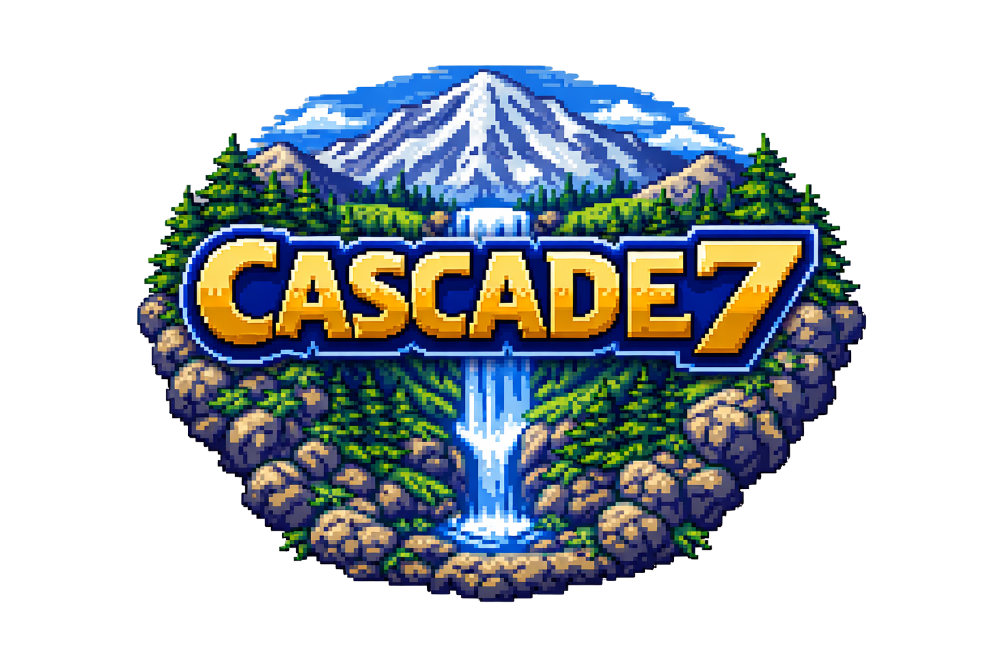
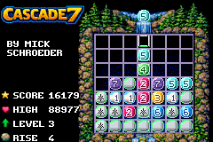

# CASCADE7

[](LICENSE)

CASCADE7 is an open-source Game Boy Advance puzzle game inspired by Drop7.





## Overview

CASCADE7 is an open-source puzzle game for Game Boy Advance. Each turn, the player drops a numbered disc into one of seven columns. Discs are numbered `1-7` or blank, numbered discs clear when their value matches the same number of discs in their row or column. Clears also strike adjacent blanks: the first hit cracks a blank disc, and the second hit reveals it as a numbered disc. After a set number of turns, a full row rises from the bottom of the board. There is no time limit, and the goal is to survive as long as possible by creating clears, triggering cascades, and pushing for high scores. Clearing the entire board awards a `70,000` point bonus.

## Install

<a href="https://github.com/mick-schroeder/gba-cascade7/releases">
  
</a>

## Controls

- `LEFT/RIGHT`: move the drop cursor
- `A`: drop the next disc
- `L/R`: snap to board edges
- `START` or `SELECT`: pause / help / about / new game

## Rules

- **GAME BOARD** - You drop one disc at a time into any of the seven columns. Discs are either numbered (1–7) or blank.
- **CLEARING DISCS:** Numbered discs clear when their value matches the same number of discs in their row or column.
- **BLANK DISCS** - Blank discs crack on the first adjacent hit and reveal into numbered discs on the next hit.
- **LEVEL UP** - After a set number of drops, the "level" increases, and a new row of blank discs is pushed up from the bottom of the grid.
- **GAME OVER** - The game ends when the column overflows at the top of the board.

### Scoring

- **CASCADE** - Create a `CASCADE` by triggering a sequence of successive matches to score more points.
- **CLEAR** - Clear the entire board to score a `70,000` point bonus.

### Game Modes

- **STANDARD** - A standard mix of numbered and blank discs with increasing level frequency.
- **FAST** - Faster gameplay with only 5 drops per level and no blank discs to drop.

## Build

Clone with submodules so the local `butano/` dependency is present:

```sh
git clone --recurse-submodules https://github.com/mick-schroeder/gba-cascade7
cd gba-cascade7
make
```

This project targets a standard Butano + `devkitARM` setup.

The build produces `CASCADE7.gba`.


## Asset Workflow

- `graphics/`: sprite sheets and background graphics
- `audio/`: sound effect

## Project Layout

- [`include/cascade7/game.h`](include/cascade7/game.h): game state and flow
- [`include/cascade7/rules.h`](include/cascade7/rules.h): match and clear rules
- [`include/cascade7/scoring.h`](include/cascade7/scoring.h): score tuning
- [`src/cascade7_game.cpp`](src/cascade7_game.cpp): runtime logic, RNG, progression, input
- [`src/cascade7_rules.cpp`](src/cascade7_rules.cpp): clear and reveal resolution
- [`src/cascade7_renderer.cpp`](src/cascade7_renderer.cpp): board, HUD, feedback, menus

## Author

- [Mick Schroeder](https://www.mickschroeder.com)

## Licensing & Credits

- © 2026 Mick Schroeder, LLC. — [MIT License](./LICENSE)  
- “CASCADE7” name and logo are trademarks of Mick Schroeder, LLC.  
- [Engine framework: Butano](https://github.com/GValiente/butano)

## Trademark Notice

“CASCADE7”, the game logo, and related marks are trademarks of Mick Schroeder, LLC.  
You may not use these names, logos, or identifying marks to distribute modified  
versions of this software or to publish derivative apps without express written permission.
